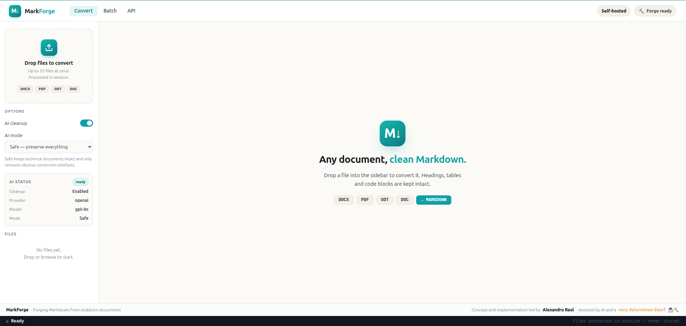
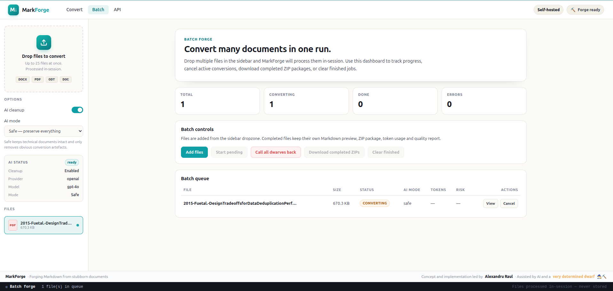
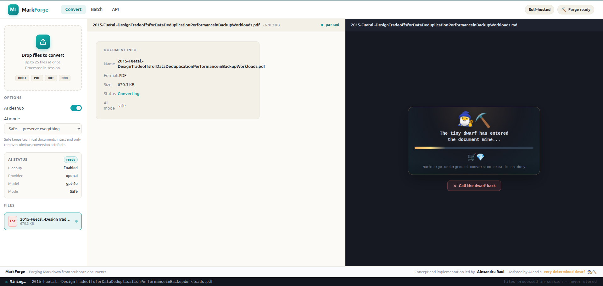
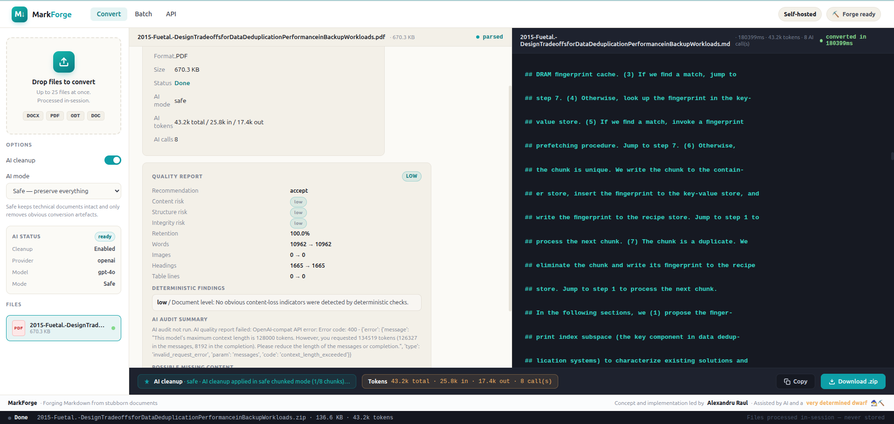

# 🧙‍♂️⛏️ MarkForge

**Forging Markdown from stubborn documents.**

MarkForge is a self-hosted document conversion forge that turns **DOCX, DOC, ODT and PDF** files into clean Markdown packages, with figures, optional AI cleanup, token visibility, and quality reporting.

It is built for technical documentation, Obsidian vaults, MkDocs sites, RAG pipelines, engineering knowledge bases, and anyone who has ever looked at a Word document and whispered: _“There must be a better way.”_ 😄

**MarkForge is an open-source project by Punctiq.**  
**Concept and implementation led by Alexandru Raul.**

---

## 🖼️ Screenshots



---


---

---



## ✨ Features

- 📄 Convert **DOCX**, **DOC**, **ODT** and **PDF** documents to Markdown
- 📦 Export Markdown and figures as a ZIP package
- 🖼️ Preserve extracted figures and image references
- 🧠 Optional AI cleanup with selectable modes:
  - 🛡️ **Safe** — maximum preservation
  - ⚖️ **Balanced** — stronger formatting cleanup
  - 🔥 **Aggressive** — stronger cleanup for messy conversions
- 📊 AI quality report with:
  - content risk
  - structure risk
  - integrity risk
  - recommendation
- 🔢 Token usage visibility
- 🧺 Batch conversion UI
- 🧙‍♂️ Dwarf-powered conversion animation, because serious tools deserve a little joy
- 🐳 Docker-friendly self-hosted workflow

---

## 🧭 What MarkForge does

MarkForge follows a simple but careful flow:

```text
Document upload
  -> deterministic conversion
  -> optional AI cleanup
  -> deterministic comparison
  -> optional AI quality audit
  -> Markdown preview
  -> ZIP export with figures and reports
```

When **AI cleanup is OFF**:

```text
convert only
  -> deterministic report only
  -> no AI call
  -> no token usage
```

When **AI cleanup is ON**:

```text
convert
  -> cleanup selected mode
  -> deterministic comparison
  -> AI quality report
  -> show report in UI
  -> include report in ZIP
```

---

## 🚀 Quick start

```bash
python -m venv .venv
source .venv/bin/activate
pip install -r requirements.txt
cp .env.example .env
make run
```

Then open:

```text
http://localhost:5000
```

---

## 🐳 Docker

MarkForge's Docker setup is intended for production behind HAProxy and Cloudflare:

```text
Cloudflare -> HAProxy bare metal -> 127.0.0.1:8010 -> Docker -> Gunicorn -> Flask
```

Build and run:

```bash
docker compose build
docker compose up -d
```

Logs and health:

```bash
docker compose logs -f markforge
curl http://127.0.0.1:8010/api/v1/health
```

The compose file binds MarkForge only on the host loopback interface:

```text
127.0.0.1:8010:5000
```

HAProxy should expose the public HTTPS domain and route to `127.0.0.1:8010`.

Production `.env` checklist:

```env
FLASK_ENV=production
AUTH_ENABLED=true
SESSION_COOKIE_SECURE=true
TRUST_PROXY=true
GOOGLE_OAUTH_REDIRECT_URI=https://markforge.alexandru-raul.ro/auth/callback
AUTH_ALLOWED_EMAILS=your-email@example.com
SECRET_KEY=<strong random value>
UPLOAD_TEMP_DIR=/tmp/markforge
CORS_ORIGINS=https://markforge.alexandru-raul.ro
```

Keep `.env` local and never commit real Google OAuth credentials, LLM API keys, or `SECRET_KEY`.

Jenkins deployments should use a Jenkins **Secret File** credential containing the production `.env` file. Set `ENV_SECRET_FILE_CREDENTIAL_ID` in the `Jenkinsfile` to that credential ID, and do not use Jenkins Config File Provider or Managed File entries for secret-bearing `.env` content.

In Google Cloud Console, add this authorized redirect URI:

```text
https://markforge.alexandru-raul.ro/auth/callback
```

Concise HAProxy backend example:

```haproxy
backend markforge_backend
    mode http
    option forwardfor
    http-request set-header X-Forwarded-Proto https
    http-request set-header X-Forwarded-Host %[req.hdr(Host)]
    http-request set-header X-Forwarded-Port 443
    option httpchk GET /api/v1/health
    http-check expect status 200
    server markforge 127.0.0.1:8010 check
```

---

## 🧠 AI cleanup

AI cleanup is optional. If disabled, MarkForge performs deterministic conversion only.

Supported modes:

| Mode | Purpose | Risk |
|---|---|---|
| 🛡️ Safe | Preserve as much as possible, remove only obvious artefacts | Lowest |
| ⚖️ Balanced | Improve Markdown readability while preserving content | Medium-low |
| 🔥 Aggressive | Stronger cleanup for messy conversions | Higher, review recommended |

The AI is treated as an assistant, not as the owner of the document.

MarkForge validates AI output and rejects suspicious cleanup results when content appears to be missing, images are changed, headings are heavily reduced, or Markdown structure looks broken.

---

## 📊 Quality report

MarkForge generates a quality report to help you understand what changed.

The report can include:

- 🧾 word count before/after
- 🖼️ image reference checks
- 🧱 heading structure checks
- 📋 table line checks
- 🧠 AI audit summary
- ⚠️ possible missing content
- 🔀 possible reordered content
- ✍️ possible grammar/text rewrites
- ✅ recommendation

Generated ZIP files may include:

```text
markforge-quality-report.json
markforge-quality-report.md
```

---

## 🔐 API keys and privacy

For self-hosted usage, API keys should be provided through environment variables or a future BYOK workflow.

Never commit real secrets.

```env
LLM_PROVIDER=openai
LLM_MODEL=gpt-4o-mini
LLM_API_KEY=
```

Recommended rule:

```text
.env stays local.
.env.example goes public.
```

---

## 🤖 Supported / planned AI providers

Current and planned provider model:

- ✅ OpenAI
- ✅ Anthropic
- ✅ Groq
- ✅ OpenAI-compatible endpoints
- 🧪 xAI / Grok
- ⚠️ GitHub Copilot is not treated as a standard direct LLM API provider

---

## 🔐 Google Login Setup

MarkForge can be protected with Google login for personal or private use. When authentication is enabled, opening the app redirects to the login page, and only allowlisted Google accounts can access MarkForge.

No database, password registration, or user management system is required.

### Enable Google login in MarkForge

Add these values to your local `.env` file:

```env
AUTH_ENABLED=true
SECRET_KEY=replace-with-a-long-random-secret
GOOGLE_OAUTH_CLIENT_ID=your-google-client-id
GOOGLE_OAUTH_CLIENT_SECRET=your-google-client-secret
GOOGLE_OAUTH_REDIRECT_URI=http://localhost:5000/auth/callback
AUTH_ALLOWED_EMAILS=your-email@gmail.com
SESSION_COOKIE_SECURE=false
SESSION_COOKIE_SAMESITE=Lax
```

Generate a strong `SECRET_KEY` with:

```bash
python -c "import secrets; print(secrets.token_urlsafe(64))"
```

### Create Google OAuth credentials

1. Go to the Google Cloud Console.
2. Create a project or select an existing project.
3. Open **APIs & Services**.
4. Open **OAuth consent screen**.
5. Configure the app name, support email, and developer contact email.
6. For personal use, testing mode is enough.
7. Add your Google account as a test user if Google asks for test users.
8. Open **Credentials**.
9. Create an **OAuth Client ID**.
10. Choose **Web application**.
11. Add this authorized redirect URI:

```text
http://localhost:5000/auth/callback
```

12. Copy the Client ID and Client Secret into your `.env` file.

### Test locally

Start MarkForge:

```bash
make run
```

Then open:

```text
http://localhost:5000
```

You should see the MarkForge login page. Click **Continue with Google**, sign in with the allowlisted Google account, and after a successful login you should be redirected into MarkForge.

### Production notes

- Use HTTPS.
- Set `SESSION_COOKIE_SECURE=true`.
- Use your production redirect URI, for example:

```text
https://your-domain.example/auth/callback
```

- Add the same production URI in Google Cloud Console.
- Keep `GOOGLE_OAUTH_CLIENT_SECRET` and `SECRET_KEY` out of Git.

### Troubleshooting

- `redirect_uri_mismatch`: the URI in `.env` must exactly match the Google Cloud authorized redirect URI.
- `Access denied`: your email must be listed in `AUTH_ALLOWED_EMAILS`.
- Login loop or cookies not saved: check `SECRET_KEY`, HTTPS, `SESSION_COOKIE_SECURE`, and proxy settings.
- Auth disabled: make sure `AUTH_ENABLED=true`.

## 🧪 Development

```bash
python -m compileall app
make run
```

If you change the UI, hard refresh your browser:

```text
Ctrl + Shift + R
```

---

## 🛡️ Disclaimer

AI cleanup and quality reports are assistive.

Always review generated Markdown before using it in production documentation, customer-facing deliverables, compliance workflows, or knowledge bases.

The dwarf is brave, but he is not legally responsible for your documentation. 🧙‍♂️⛏️

---

## 🧑‍🏭 Credits

**MarkForge is an open-source project by Punctiq.**  
**Concept and implementation led by Alexandru Raul.** 
Assisted by AI and a very determined dwarf. 🧙‍♂️⛏️💎

---

## 📜 License

Licensed under the **Apache License 2.0**.
